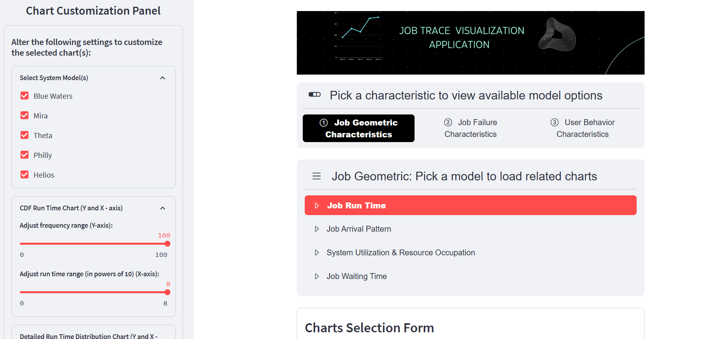

  


# Job Trace Analysis Tool

This application delivers extensive plots for analyzing job traces with dynamic functionalities, concentrating on geometric, user, and failure characteristics. In its current iteration, it exclusively showcases pre-existing job traces for analysis. A forthcoming update will introduce the capability for users to upload and analyze their own job traces, significantly enhancing its utility and flexibility.

## Live Application

The project is also live at [https://lumos-job-traces.streamlit.app/](https://lumos-job-traces.streamlit.app/). You can access the web application to analyze job traces interactively without installing the software locally.

## Preview of the Application

Here's a quick preview of what you can expect from the Job Trace Analysis Tool:



## Interpreting Results

To understand the analysis results, please refer to the **Description Section** located under each plot within the application. Reading these descriptions will help you interpret the plots accurately and gain a deeper understanding of the data presented.

## Getting Started Locally 

These instructions will get you a copy of the project up and running on your local machine for development and testing purposes. See deployment for notes on how to deploy the project on a live system.

## Pre-requisites

- Python 3.9 and later

## Installation

1. Clone repository

```
git clone https://github.com/DIR-LAB/lumos.git
cd lumos/lumos-site
```

2. Install required packages:

```bash
pip install -r requirements.txt
```

3. Run the application:

```bash
python app.py
```

## Usage

After installation, you can start analyzing job traces by running the application.  

# <span style="color:grey;">More features coming soon!</span>


## Support and Contact

If you have any queries or need support regarding the application, please reach out to us at: 

- Monish Soundar Raj - msoundar@charlotte.edu
- Dong Dai - ddai@charlotte.edu
- Di Zhang - dzhang16@uncc.edu

We are looking forward to your feedback and contributions to make this tool more useful for everyone.

## Contributing

We welcome contributions to improve this project, either adding a new feature or improving documentation. If you have a suggestion that would make this better, please fork the repository and create a pull request. You can also simply open an issue with the tag "enhancement".

Don't forget to give the project a star! Thanks again!

1. Fork the Project
2. Create your Feature Branch 
3. Commit your Changes 
4. Push to the Branch 
5. Open a Pull Request
